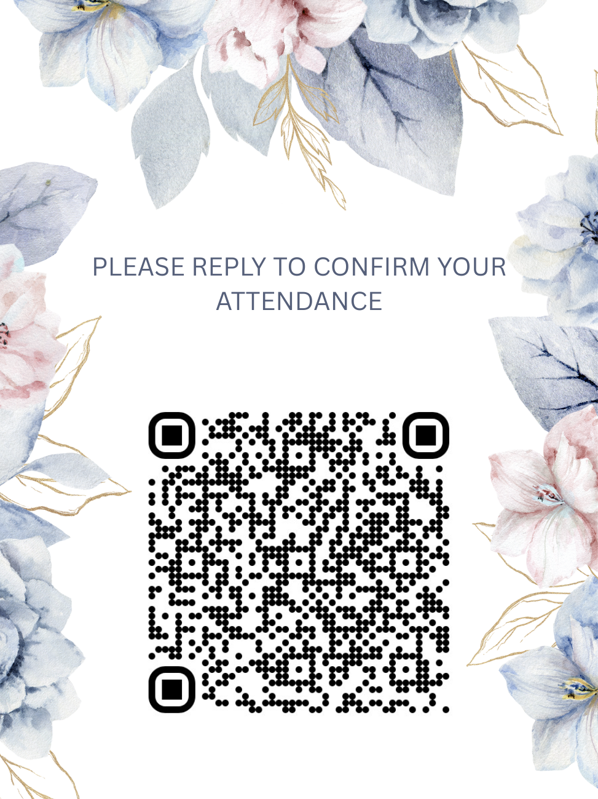
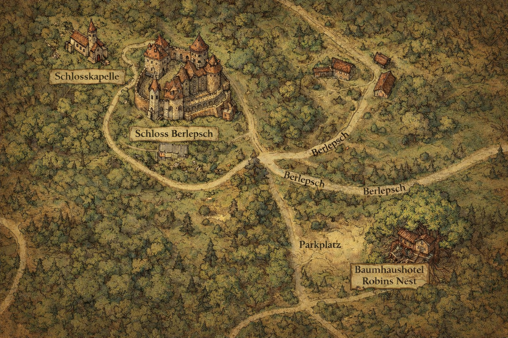
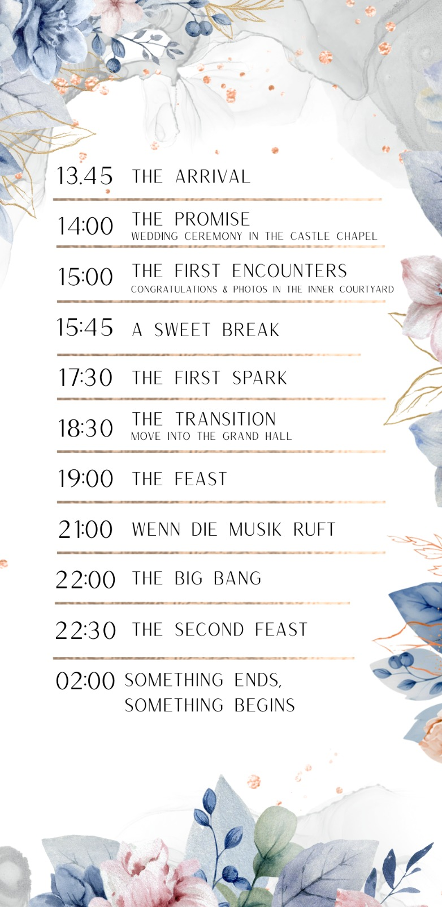

# 💍 Anfisa & Philipp — Our Wedding Repository

Welcome to our wedding GitHub repository!  
We created this space as a fun way to keep our guests informed and up to date.
🇩🇪 Deutsch below!

Please Scan or click to confirm your attendance:

 
  

---

## 🇬🇧 English

### 📅 Wedding Details

- **Date:** October 17th  2026
- **Time:** 13:45 
- **Location:** Schloss Berlepsch (Berlepsch Castle)
- **Dress Code:** Formal   

### 📍 Venue

**Name:** Schloss Berlepsch 
**Address:** Berlepsch 1, 37218 Witzenhausen, Germany

**Map:** [(Link to Google Maps)](https://maps.app.goo.gl/kRaGyfbSyTYx253P6)

The wedding will take place in the "Schlosskapelle". Festivities will continue in the "Schloss". [A detailed map can be found here](Detailed_Berlepsch%20map.png)

### 🏨 Accommodation
**Please contact us before booking!**
We will organize car rides to the location if needed.
Recommended hotels and places to stay:

- Baumhaushotel Robins Nest (200 m) – [Website](https://www.robins-nest.de/)
- Hotel Garni Wolf (5 km) – [Website](http://www.hotel-garni-wolf.de/zimmer/)
- Hotel Biewald (7 km) – [Website](https://www.landhaus-biewald.de/)
- Schillingshof (10 km) - [Website](https://direct-book.com/properties/schillingshof?locale=de&items[0][adults]=2&items[0][children]=0&items[0][infants]=0&currency=EUR&checkInDate=2026-10-17&checkOutDate=2026-10-18&trackPage=yes)

### 🚗 Transportation

Information about how to get there:

- By car: Use the Google Maps link above. The venue is located next to the Autobahn. [ The parking spots are marked on the here.](Detailed_Berlepsch%20map.png)
- By train/bus: From Göttingen you can take a train, bus and finally walk for about 20 Minutes to reach the venue. An example can be found [here](https://www.google.com/maps/dir/G%C3%B6ttingen,+Bahnhofspl.+1,+37073+G%C3%B6ttingen/Berlepsch,+37218+Witzenhausen/@51.4008444,9.8370717,3511m/am=t/data=!3m1!1e3!4m19!4m18!1m5!1m1!1s0x47a4d4b9a12cd6cb:0xf7b53240993d3c13!2m2!1d9.9267746!2d51.5366249!1m5!1m1!1s0x47bb3320601f2019:0x71695ddd8722918e!2m2!1d9.8369789!2d51.3959382!2m3!6e0!7e2!8j1771063200!3e3!5i5?entry=ttu&g_ep=EgoyMDI2MDIwNC4wIKXMDSoASAFQAw%3D%3D)
- By plane: We are located in the middle of Germany. The closets main airports are: Hannover, Frankfurt, Hamburg, Berlin. You will then need a train connection to Göttingen (about 2.5 h from Frankfurt)

### 📋 Schedule

    

### 📸 Photos & Social Media

- Hashtag: **#[YourHashtag]**
- Upload link: [Link]

### 📬 Contact

If you have any questions, feel free to contact us via WhatsApp :)

---

## 🇩🇪 Deutsch

### 📅 Hochzeitsdetails

- **Datum:** 17. Oktober 2026
- **Uhrzeit:** 13:45 
- **Ort:** Schloss Berlepsch
- **Dresscode:** Elegant 

### 📍 Veranstaltungsort

**Name:** Schloss Berlepsch 
**Adresse:** Berlepsch 1, 37218 Witzenhausen, Deutschland
**Karte:** [(Google Maps Link)](https://maps.app.goo.gl/kRaGyfbSyTYx253P6)

Die Trauung findet in der Schlosskapelle statt. Die Feierlichkeiten werden anschließend im Schloss fortgesetzt.
[Einen detaillierten Lageplan findet ihr hier](Detailed_Berlepsch%20map.png)

### 🏨 Unterkünfte
**Bitte kontaktiert uns bevor ihr bucht!** Wir werden einen Fahrservice organiseren.
Empfohlene Hotels und Übernachtungsmöglichkeiten:

- Baumhaushotel Robins Nest (200 m) – [Website](https://www.robins-nest.de/)
- Hotel Garni Wolf (5 km) – [Website](http://www.hotel-garni-wolf.de/zimmer/)
- Hotel Biewald (7 km) – [Website](https://www.landhaus-biewald.de/)
- Schillingshof (10 km) - [Website](https://direct-book.com/properties/schillingshof?locale=de&items[0][adults]=2&items[0][children]=0&items[0][infants]=0&currency=EUR&checkInDate=2026-10-17&checkOutDate=2026-10-18&trackPage=yes)

### 🚗 Anreise

Informationen zur Anfahrt:

- Mit dem Auto: Mit dem Auto: Nutzt bitte den Google-Maps-Link oben.
  Die Location liegt in der Nähe der Autobahn.  [Die Parkplätze sind hier markiert.](Detailed_Berlepsch%20map.png)
- Mit Bahn/Bus: Von Göttingen aus könnt ihr mit dem Zug, Bus und anschließend zu Fuß (ca. 20 Minuten) anreisen.
  Eine Beispielroute findet ihr [hier.](https://www.google.com/maps/dir/G%C3%B6ttingen,+Bahnhofspl.+1,+37073+G%C3%B6ttingen/Berlepsch,+37218+Witzenhausen/@51.4008444,9.8370717,3511m/am=t/data=!3m1!1e3!4m19!4m18!1m5!1m1!1s0x47a4d4b9a12cd6cb:0xf7b53240993d3c13!2m2!1d9.9267746!2d51.5366249!1m5!1m1!1s0x47bb3320601f2019:0x71695ddd8722918e!2m2!1d9.8369789!2d51.3959382!2m3!6e0!7e2!8j1771063200!3e3!5i5?entry=ttu&g_ep=EgoyMDI2MDIwNC4wIKXMDSoASAFQAw%3D%3D)
- Wir wohnen in der Mitte Deutschlands.
  Die nächstgelegenen größeren Flughäfen sind: Hannover, Frankfurt, Hamburg und Berlin.
  Von dort aus benötigt ihr eine Zugverbindung nach Göttingen (ca. 2,5 Stunden von Frankfurt).

### 📋 Ablauf

| Uhrzeit | Programmpunkt |
|---------|---------------|
| [ ]     | Trauung |
| [ ]     | Sektempfang |
| [ ]     | Abendessen |
| [ ]     | Feier |

### 📸 Fotos & Social Media

- Hashtag: **#[EuerHashtag]**
- Upload-Link: [Link]

### 📬 Kontakt

Bei Fragen könnt ihr uns gerne jederzeit per WhatsApp kontaktieren

---

## ❤️ Thank You / Danke

Thank you for celebrating this special day with us.  
We can’t wait to see you!

Danke, dass ihr diesen besonderen Tag mit uns teilt.  
Wir freuen uns sehr auf euch!

With love / Mit Liebe,  
**Anfisa & Philipp**
